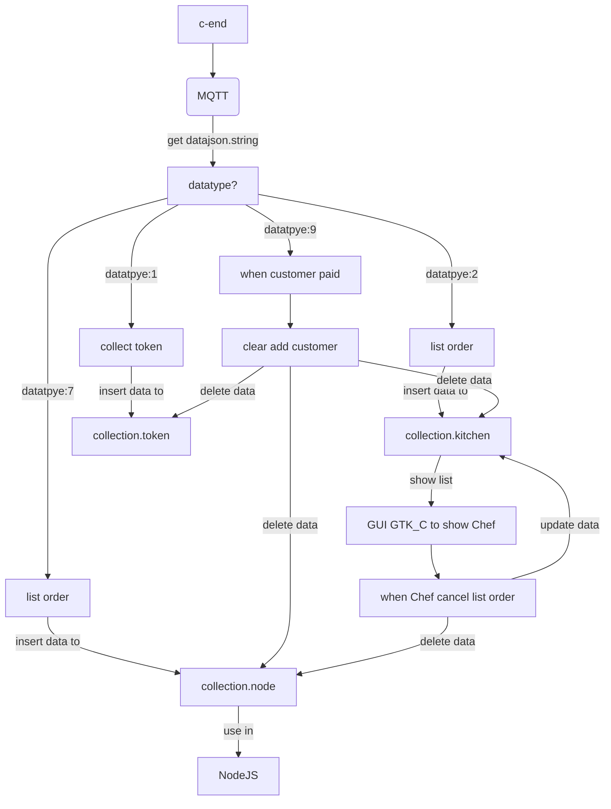

# Ordishes Project - C Backend first_week
### main in work
- publish data.JSON from MQTT
- tranform data.JSON to data.BSON/BCON
- sent data.BSON/BCON to MongoDB

## Progress of C Backend
in first week C Backend
- MQTT
    - [ ] publish data.JSON.
-------------------------------------
- Mongo C driver
    - [x] learn MongoDB.
    - [x] compile Mongo C driver.
-------------------------------------
- learn Mongo C driver.
    - [x] **Connect** Mongo C driver.
    - [x] **Inserting** a Document Mongo C driver.
    - [x] **Finding** a Document Mongo C driver.
    - [x] **Look for** a specific document Mongo C driver.
    - [x] **Updating** a Document Mongo C driver.
    - [x] **Deleting** a Document Mongo C driver.
    - [x] **Counting** a Document Mongo C driver.
    - [x] **collStats** a Document Mongo C driver.

-------------------------------------
## flow for first week.

-------------------------------------
## Installing the MongoDB C Driver (libmongoc) and BSON library (libbson) .
- Install libmongoc with a Package Manager.\
`$ sudo apt-get install libmongoc-1.0-0`

## Installtion Mongo C Driver.
```
$ git clone https://github.com/mongodb/mongo-c-driver.git
$ cd mongo-c-driver
$ git checkout 1.19.0
$ python build/calc_release_version.py > VERSION_CURRENT
$ mkdir cmake-build
$ cd cmake-build
$ cmake -DENABLE_AUTOMATIC_INIT_AND_CLEANUP=OFF ..
$ cmake --build .
$ sudo cmake --build . --target install
```

## Connect to MongoDB Atlas 
code from : https://docs.mongodb.com/drivers/c/
```c
#include <mongoc/mongoc.h>
int main (int argc, char *argv[])
{
   mongoc_database_t *database;
   mongoc_client_t *client;
   mongoc_init ();
   // Replace the uri string with your MongoDB deployment's connection string.
   client = mongoc_client_new(
      "mongodb+srv://<username>:<password>@<cluster-url>/test?retryWrites=true&w=majority"
   );
   database = mongoc_client_get_database (client, "test");
   mongoc_database_destroy (database);
   mongoc_client_destroy (client);
   mongoc_cleanup ();
   return 0;
}

```
-------------------------------------
# Ordishes Project - C Backend second_week
### main in work
- publish data.JSON from MQTT
- tranform data.JSON to data.BSON/BCON
- sent data.BSON/BCON to MongoDB

## Progress of C Backend
in second week C Backend
- MQTT
    - [x] test publish datajson.string. 
    - [x] test submit datajson.string. 
-------------------------------------
- MongoDB for database
    - [x] get string from MQTT_publish. 
    - [x] edit datajson.string to data.BSON/BCON.
    - [x] insert data in MongoDB.
-------------------------------------
- MongoDB for help kitchen
    - [x] edit datajson.string to data.BSON/BCON.
    - [X] lookfor data in MongoDB.
    - [X] update data in MongoDB.
    - [X] count data in MongoDB.
    - [X] count data in MongoDB.
-------------------------------------
## flow for second week.

-------------------------------------
# Ordishes Project - C Backend third_week
### main in work
- publish data.JSON from web customer
- sent data.BSON/BCON to MongoDB 

## Progress of C Backend
in third week C Backend
- MongoDB for database
    - [x] get string from MQTT_broken main web customer. 
    - [x] edit datajson.string to data.BSON/BCON.
    - [x] insert datatype in some MongoDB.
-------------------------------------
- MongoDB for help kitchen
    - [x] cancel delete data collection(orderfornode).
-------------------------------------
## flow for third week.

