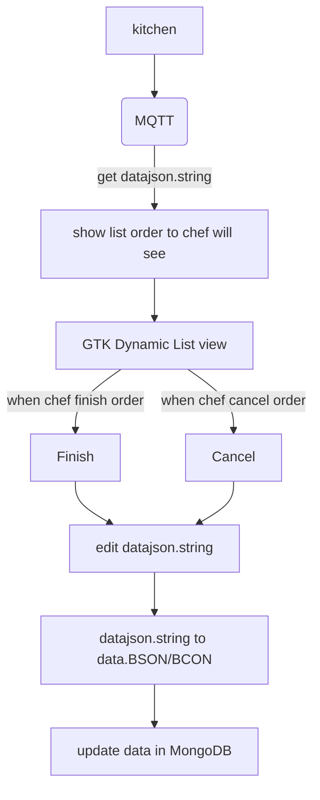

# Ordishes Project - C Kitchen
### main in work
- submit datajson.string from MQTT.
- tranform datajson.string to data.BSON/BCON.
- show list dish to chef.
- can selection the order to check finish/cancel.
- sent data.BSON/BCON to update data in MongoDB.

## Progress of C Kitchen
in second week C Kitchen
- MQTT & MongoDB @Noraset.K
    - [x] test publish datajson.string. 
    - [x] edit datajson.string to data.BSON/BCON.
    - [x] check data is orderid.
    - [x] update data in MongoDB.
-------------------------------------
- GTK.c
    - [x] design GUI(GTK) use GTK Dynamic List view. 
    - [x] append list from datajson.string to show chef what's it in order.
    - [x] get string from select list do chef want to update.
    - [x] clear list when chef updated.
-------------------------------------
## flow for second week.

