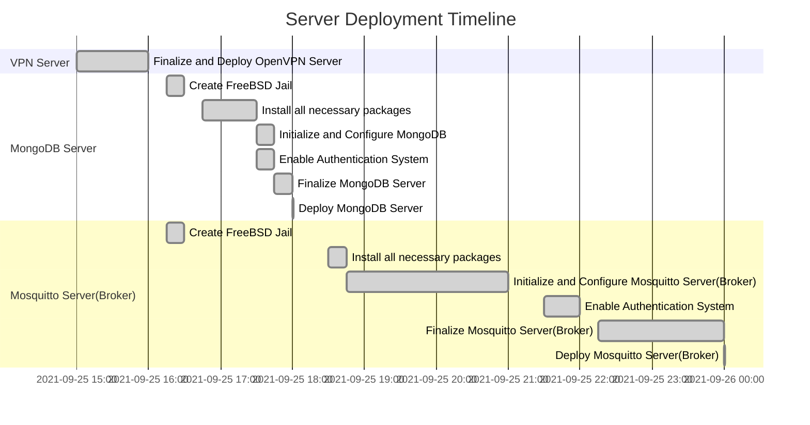

# Ordishes : Software Development Practice 1 Mini-Project

## Project Overview
This project featured an online food ordering system powered by NodeJS and C. For Customer side, we will use React for front-end and NodeJS for backend. For kitchen side, we will use GTK in C language to make the GUI and make the connection to the MQTT broker for transferring data. For restaurant side, we will use script powered by C language to make a process most of the data that is begin passed into MQTT broker. The Restaurant side C language script will also be use to write, delete and update MongoDB. To transfer data between NodeJS and C Language Script, we use MQTT Broker as the data medium between Cashier/Customer and Restaurant.
### Key Features
- Kitchen Side GUI using GTK3 for order management.(Changing order status and cancelling orders)
- React Frontend for both customer and cashier.
- Token and QR Code can be easily generate by cashier.
- QR Code will log customer in automatically without any additional user input.
- Manual token login page for customer who can't scan QR code.
- Simple and easy-to-use web application GUI
### Normal Features
- API domain can be easily configure by editing file in `React_Frontend/src/variable/axios.js`
- Web application can be easily deployed as the `NodeJS Backend Script` can be configured to serve React JS static build from `React_Frontend` directory directly by editing `/Node_Backend/routes/index.js` (by Changing `EnableRenderFromBuild` variable value to `true`)
### Database Access and Management for script
>>>
In this project, only C Language Script(Kitchen/Restaurant) will have permission to write to the database as all data need to be processed before taking any action to the database. NodeJS Backend(API) will have permission to read database to reduce data transfer time and make data access easier as it doesn't need to go through C Language Script first.
>>>
| Script | Access/Permission |
| ------ | ------ |
| Kitchen/Restaurant Backend (C Language) | Full Access (Read and Write) |
| NodeJS Backend (Javascript) | Read Only |
| React Frontend (Javascript) | No direct access to the database (Use API instead) |

## Project Progress And Documentation
You can view the project progress and documentation in the directory listed below.
| Directory Name | Description |
| ------ | ------ |
| C_Backend | Restaurant Side Backend for Kitchen GUI and database management |
| Node_Backend | Client Side(Customer and Cashier) API for the web application to get the data |
| React_Frontend | Cliend Side(Customer and Cashier) web application for token generator and food ordering |

## Server Side Progress(First Week)
### Overview
In this server we will use FreeBSD for our server operating system to install MongoDB and Mosquitto Server as it is a light weight operating system. And for development purpose, we will use OpenVPN for our development network. All of the systems are self-managed.

### Progress
1. [x] MongoDB Server
    1. [x] Create FreeBSD Jail
    2. [x] Install MongoDB version 4.4 Package
    3. [x] Configure MongoDB and enable authorization system.
    4. [x] Start and deploy the server.
2. [x] Mosquitto Server(Broker)
    1. [x] Create FreeBSD Jail
    2. [x] Install Moquitto Package 
    3. [x] Configure Moquitto and enable authorization system.
    4. [x] Start and deploy the server.
3. [x] OpenVPN Server

