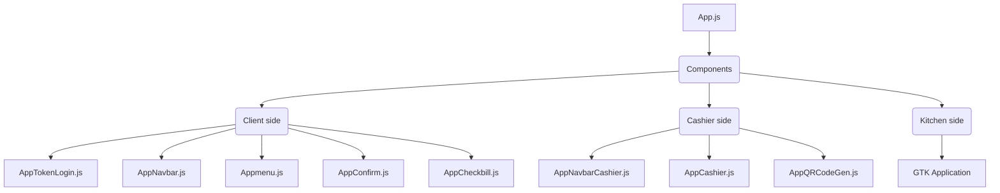

# Front-End side (update at 07/10/2021)
1. User interface design.
2. Coding button function to connect to back-end side.
3. Redesign all components in front-end with bootstrap-react.

## Progress of Front-End side 

### User interface design.
- User interface design (client) by using React.
    - [x] Create Navbar to navigate to other page (menu page, confirm page, check bill page).
    - [x] Design user interface **menu page**.
    - [x] Design user interface **confirm order page**.
    - [x] Design user interface **check bill page**.
    - [x] Design **token login page**.
    - [x] Design user interface **status page**.
- User interface design (cashier) by using React.
    - [x] Design user interface **cashier page**.
    - [x] Design user interface **qr code generate page**.
- User interface design (kitchen) by using GTK C language.
    - [x] Design user interface kitchen window application.
***
### Coding button function.
- Coding button function to connect to back-end side.
    - **menu page** (client).
        - [x] Coding button `order` menu. 
    - **confirm menu page** (client).   
        - [x] Coding button `confirm` menu.
    - **token login page** (client).
        - [x] Coding button `submit`.
    - **cashier page** (cashier).
        - [x] Coding button `deny`. 
        - [x] Coding button `confirm`. 
    - **qr code generate page** (cashier).
        - [x] Coding button `generate QR code`.
    - **kitchen application** (kitchen).
        - [x] Coding some function in kitchen application.
***
### Redesign front-end with bootstrap-react.
- User interface design by using Bootstrap-react.
    - [x] Redesign user interface **menu page** with bootstrap-react.
    - [x] Redesign user interface **confirm order page** with bootstrap-react.
    - [x] Redesign user interface **check bill page** with bootstrap-react.
    - [x] Redesign user interface **status page** with bootstrap-react.
    - [x] Redesign user interface **token login page** with bootstrap-react.
    - [x] Redesign user interface **cashier page** with bootstrap-react.
    - [x] Redesign user interface **qr code generate page** with bootstrap-react.

----------------------------------------
INSTALL NODE_MODULES BEFORE RUNNING 
----------------------------------------
LIST OF NODE_MODULES
- axios
- react
- qrcode
- react-bootstrap
- react-router-dom
- react-uuid
- query-string
- @fortawesome/react-fontawesome
- @fortawesome/fontawesome-svg-core
- @fortawesome/free-solid-svg-icons
----------------------------------------

You can istall NODE_MODULES BY usig this command  **ps.cd to frontend folder first** \
`npm install`

----------------------------------------

You can start backend server BY usig this command 
`npm start`

----------------------------------------
sever will start at port 3000
you can access by go to 'http://localhost:3000/menu' or 'http://localhost:3000/qrcode'
